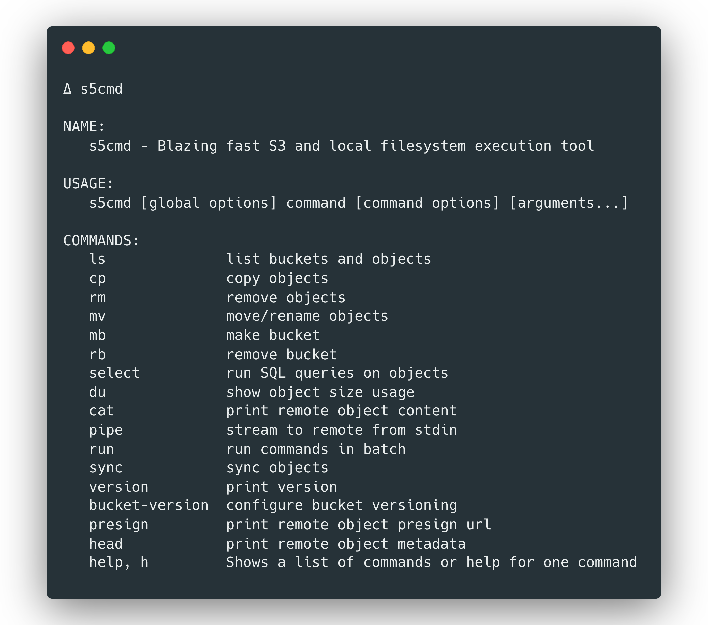

[](https://goreportcard.com/report/github.com/peak/s5cmd)

# s5cmd

`s5cmd` is a very fast S3 and local filesystem execution tool.

## Features

`s5cmd` supports wide range of object management tasks both for cloud
storage services and local filesystems.

- List buckets and objects
- Upload, download or delete objects
- Move, copy or rename objects
- Print object contents to stdout
- Create buckets
- Summarize objects sizes, grouping by storage class
- Wildcard support for all operations
- Multiple arguments support for delete operation
- Command file support to run commands in batches at very high execution speeds
- [S3 Transfer Acceleration](https://docs.aws.amazon.com/AmazonS3/latest/dev/transfer-acceleration.html) support
- Google Cloud Storage (and any other S3 API compatible service) support
- Structured logging for querying command outputs
- Shell auto-completion

## Installation

### Binaries

The [Releases](https://github.com/peak/s5cmd/releases) page provides pre-built
binaries for Linux and macOS.

### Homebrew

For macOS, a [homebrew](https://brew.sh) tap is provided:

    brew tap peak/s5cmd https://github.com/peak/s5cmd
    brew install s5cmd

### Build from source

You can build `s5cmd` from source if you have [Go](https://golang.org/dl/) 1.13+
installed.

    go get github.com/peak/s5cmd

⚠️ Please note that building from `master` is not guaranteed to be stable since
development happens on `master` branch.

## Usage

`s5cmd` supports multiple-level wildcards for all S3 operations. This is
achieved by listing all S3 objects with the prefix up to the first wildcard,
then filtering the results in-memory. For example, for the following command;

    s5cmd cp 's3://bucket/logs/2020/03/*' .

first a `ListObjects` request is send, then the copy operation will be executed
against each matching object, in parallel.

### Examples

#### Download a single S3 object

    s5cmd cp s3://bucket/object.gz .

#### Download multiple S3 objects

Suppose we have the following objects:
```
s3://bucket/logs/2020/03/18/file1.gz
s3://bucket/logs/2020/03/19/file2.gz
s3://bucket/logs/2020/03/19/originals/file3.gz
```

    s5cmd cp 's3://bucket/logs/2020/03/*' logs/


`s5cmd` will match the given wildcards and arguments by doing an efficient
search against the given prefixes. All matching objects will be downloaded in
parallel. `s5cmd` will create the destination directory if it is missing.

`logs/` directory content will look like:

```
$ tree
.
└── logs
    ├── 18
    │   └── file1.gz
    └── 19
        ├── file2.gz
        └── originals
            └── file3.gz

4 directories, 3 files
```

ℹ️ `s5cmd` preserves the source directory structure by default. If you want to
flatten the source directory structure, use the `--flatten` flag.

    s5cmd cp --flatten 's3://bucket/logs/2020/03/*' logs/

`logs/` directory content will look like:

```
$ tree
.
└── logs
    ├── file1.gz
    ├── file2.gz
    └── file3.gz

1 directory, 3 files
```

#### Upload a file to S3

    s5cmd cp object.gz s3://bucket/

#### Upload multiple files to S3

    s5cmd cp directory/ s3://bucket/

Will upload all files at given directory to S3 while keeping the folder hierarchy
of the source.

#### Delete an S3 object

    s5cmd rm s3://bucket/logs/2020/03/18/file1.gz

#### Delete multiple S3 objects

    s5cmd rm s3://bucket/logs/2020/03/19/*

Will remove all matching objects:

```
s3://bucket/logs/2020/03/19/file2.gz
s3://bucket/logs/2020/03/19/originals/file3.gz
```

`s5cmd` utilizes S3 delete batch API. If matching objects are up to 1000,
they'll be deleted in a single request.

#### Copy objects from S3 to S3

`s5cmd` supports copying objects on the server side as well.

    s5cmd cp 's3://bucket/logs/2020/*' s3://bucket/logs/backup/

Will copy all the matching objects to the given S3 prefix, respecting the source
folder hierarchy.

⚠️ Copying objects (from S3 to S3) larger than 5GB is not supported yet. We have
an [open ticket](https://github.com/peak/s5cmd/issues/29) to track the issue.

#### Count objects and determine total size

    $ s5cmd du --humanize 's3://bucket/2020/*'

    30.8M bytes in 3 objects: s3://bucket/2020/*

#### Run multiple commands in parallel

The most powerful feature of `s5cmd` is the commands file. Thousands of S3 and
filesystem commands are declared in a file (or simply piped in from another
process) and they are executed using multiple parallel workers. Since only one
program is launched, thousands of unnecessary fork-exec calls are avoided. This
way S3 execution times can reach a few thousand operations per second.

    s5cmd run commands.txt

or

    cat commands.txt | s5cmd run

`commands.txt` content could look like:

```
cp s3://bucket/2020/03/* logs/2020/03/

# line comments are supported
rm s3://bucket/2020/03/19/file2.gz

# empty lines are OK too like above

# rename an S3 object
mv s3://bucket/2020/03/18/file1.gz s3://bucket/2020/03/18/original/file.gz

# list all buckets
ls # inline comments are OK too
```

### Specifying credentials

`s5cmd` uses official AWS SDK to access S3. SDK requires credentials to sign
requests to AWS. Credentials can be provided in a variety of ways:

- Environment variables
- AWS credentials file
- If `s5cmd` runs on an Amazon EC2 instance, EC2 IAM role
- If `s5cmd` runs on EKS, Kube IAM role

The SDK detects and uses the built-in providers automatically, without requiring
manual configurations.

### Shell auto-completion

Shell completion is supported for bash, zsh and fish.

To enable auto-completion, run:

    s5cmd --install-completion

This will add a few lines to your shell configuration file. After installation,
restart your shell to activate the changes.

### Google Cloud Storage support

`s5cmd` supports S3 API compatible services, such as GCS, Minio or your favorite
object storage.

    s5cmd --endpoint-url https://storage.googleapis.com ls

will return your GCS buckets.

`s5cmd` will use virtual-host style bucket resolving for S3, S3 transfer
acceleration and GCS. If a custom endpoint is provided, it'll fallback to
path-style.

### Retry logic

`s5cmd` uses an exponential backoff retry mechanism for transient or potential
server-side throttling errors. Non-retriable errors, such as `invalid
credentials`, `authorization errors` etc, will not be retried. By default,
`s5cmd` will retry 10 times for up to a minute. Number of retries are adjustable
via `--retry-count` flag.

## Using wildcards

Most shells can attempt to expand wildcards before passing the arguments to
`s5cmd`, resulting in surprising `no matches found` errors.

To avoid this problem, surround the wildcarded expression with single quotes.

## Output

`s5cmd` supports both structured and unstructured outputs.
* unstructured output

```shell
$ s5cmd cp s3://bucket/testfile .

cp s3://bucket/testfile testfile
```

```shell
$ s5cmd cp --no-clobber s3://somebucket/file.txt file.txt

ERROR "cp s3://somebucket/file.txt file.txt": object already exists
```

* If `--json` flag is provided:

```json
    {
      "operation": "cp",
      "success": true,
      "source": "s3://bucket/testfile",
      "destination": "testfile",
      "object": "[object]"
    }
    {
      "operation": "cp",
      "job": "cp s3://somebucket/file.txt file.txt",
      "error": "'cp s3://somebucket/file.txt file.txt': object already exists"
    }
```

# LICENSE

MIT. See [LICENSE](https://github.com/peak/s5cmd/blob/master/LICENSE).
